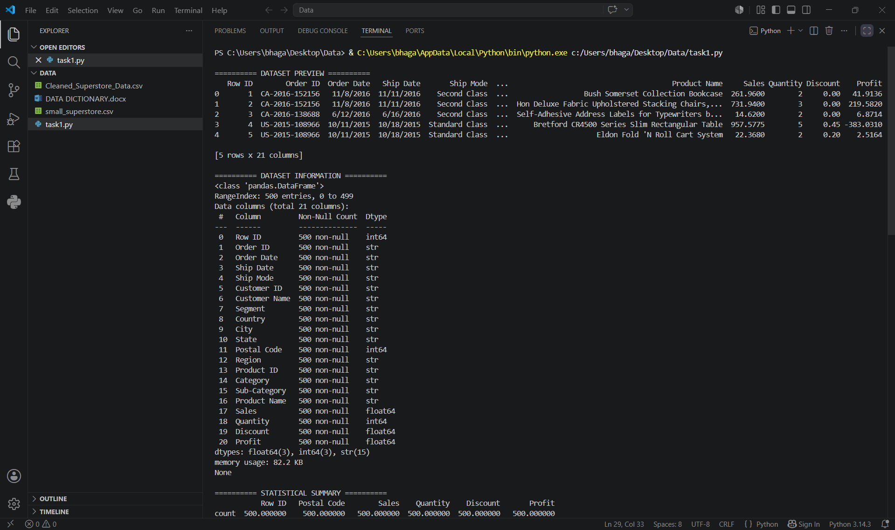
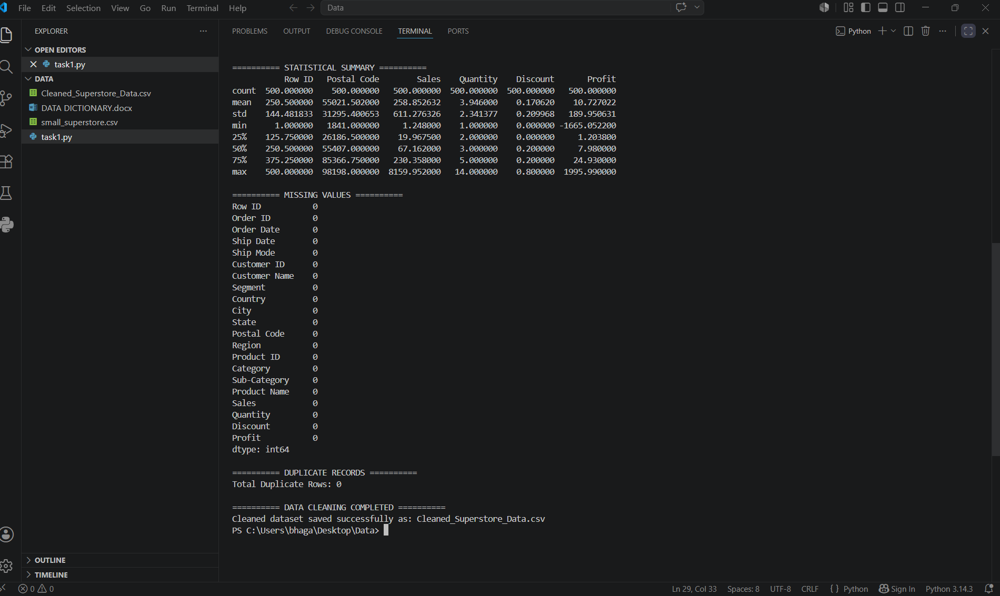

# Task 1 - Data Immersion & Wrangling

## Objective
The objective of this task is to perform data cleaning and preprocessing on the Superstore dataset using Python and Pandas. The project focuses on identifying missing values, duplicate records, and preparing the dataset for further analysis.

---

## Features
- User-friendly data cleaning workflow
- Automated missing value checking
- Duplicate record identification
- Clean dataset generation
- Structured and readable Python script

---

## Technologies Used
- Python
- Pandas
- VS Code

---

## How It Works
1. Load the dataset using Pandas.
2. Display dataset preview and information.
3. Check missing values and duplicate records.
4. Remove duplicate rows and unnecessary columns.
5. Save the cleaned dataset into a new CSV file.

---

## Tasks Performed
- Loaded the Superstore dataset using Pandas
- Displayed dataset preview and dataset information
- Checked missing values in each column
- Identified duplicate rows in the dataset
- Removed unnecessary columns
- Saved the cleaned dataset as a new CSV file

---

## Output Screenshot

---

## Outcome
Successfully cleaned and prepared the dataset for further data analysis and visualization.

---

## Author
Khushi Bhagat
