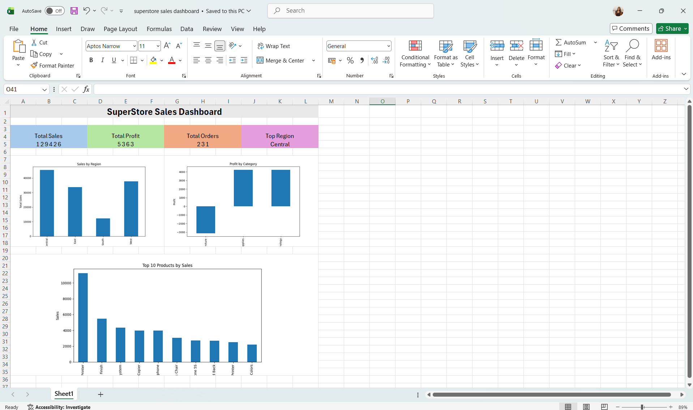
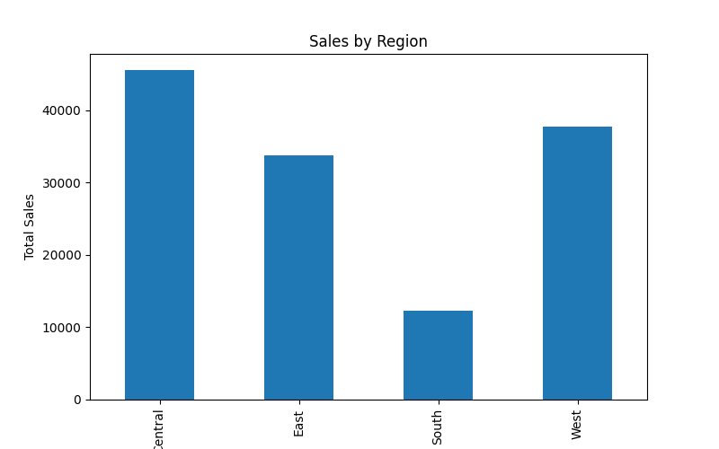
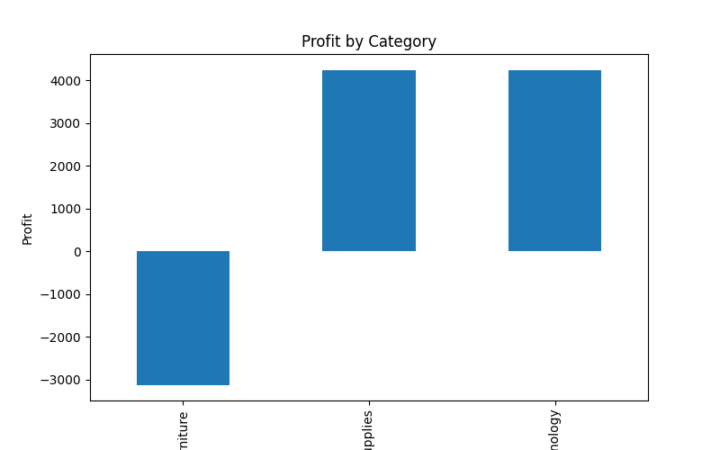
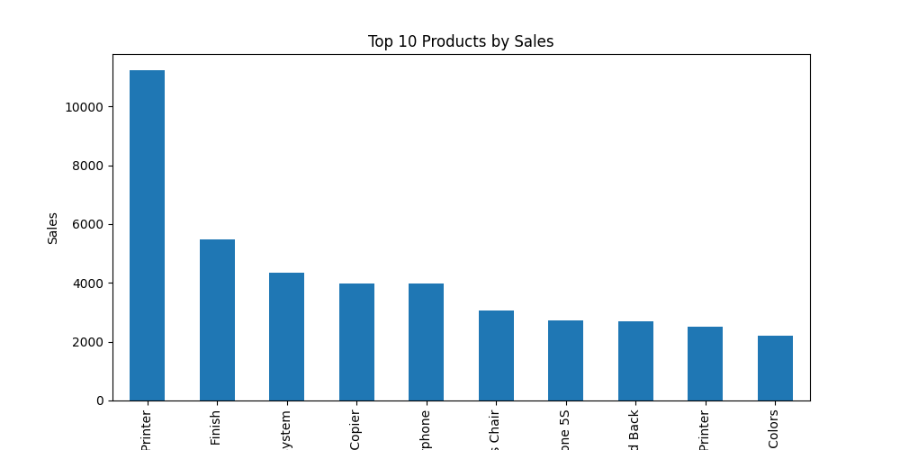
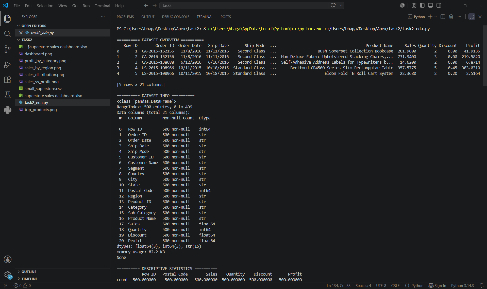
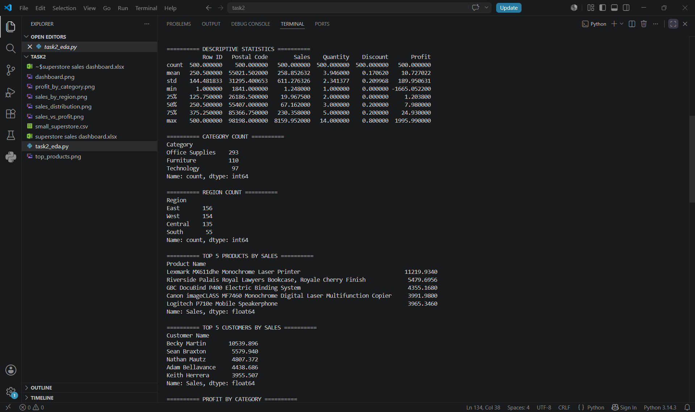
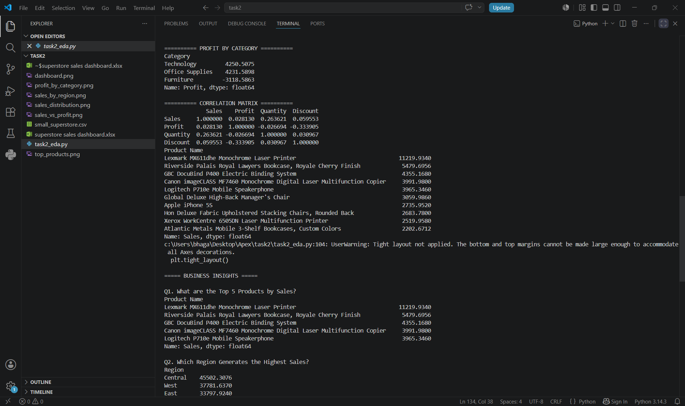
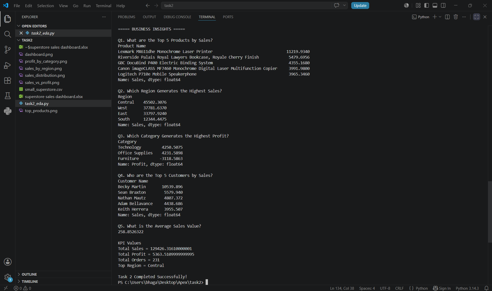

# 📊 Task 2 - Exploratory Data Analysis (EDA) & Business Intelligence

## 🎯 Objective

To perform Exploratory Data Analysis (EDA) on the Superstore dataset, uncover business insights, identify sales and profit trends, and build an interactive dashboard for decision-making.

---

## 🛠 Technologies Used

- Python
- Pandas
- Matplotlib
- Excel
- VS Code

---

## 📂 Dataset

Dataset Used: `small_superstore.csv`

The dataset contains:
- 500 records
- 21 columns
- Sales, Profit, Orders, Customers, Products, Categories, and Regions information

---

## 🔍 Tasks Performed

### 1. Data Exploration
- Loaded and inspected the dataset
- Checked data structure and column information
- Generated descriptive statistics

### 2. Exploratory Data Analysis
- Analyzed sales distribution
- Compared sales across regions
- Evaluated profit by category
- Identified top-performing products
- Examined customer purchasing behavior

### 3. Business Intelligence
Answered key business questions:

1. Top 5 Products by Sales
2. Sales Performance by Region
3. Profit by Category
4. Top 5 Customers by Sales
5. Average Sales Value

### 4. Dashboard Creation
Created an Excel dashboard containing:
- Total Sales KPI
- Total Profit KPI
- Total Orders KPI
- Top Region KPI
- Sales by Region Chart
- Profit by Category Chart
- Top Products by Sales Chart

---

## 📋 Dashboard

An Excel dashboard was created containing:

- KPI Cards
  - Total Sales
  - Total Profit
  - Total Orders
  - Top Region

- Charts
  - Sales by Region
  - Profit by Category
  - Top 10 Products by Sales

---

## 📸 Dashboard Preview

### Excel Dashboard

### Sales by Region

### Profit by Category

### Top Products by Sales

---

## 📸 Project Screenshots

### Output 1

### Output 2

### Output 3

### Business Question & Insights

## 📊 KPI Metrics

| Metric | Value |
|----------|----------|
| Total Sales | 129,426 |
| Total Profit | 5,364 |
| Total Orders | 231 |
| Top Region | Central |

---

## ✅ Outcome

Successfully performed Exploratory Data Analysis (EDA), answered key business questions, generated visulizations, and designed an Excel dashboard to visualize sales performance and support business decision-making.
