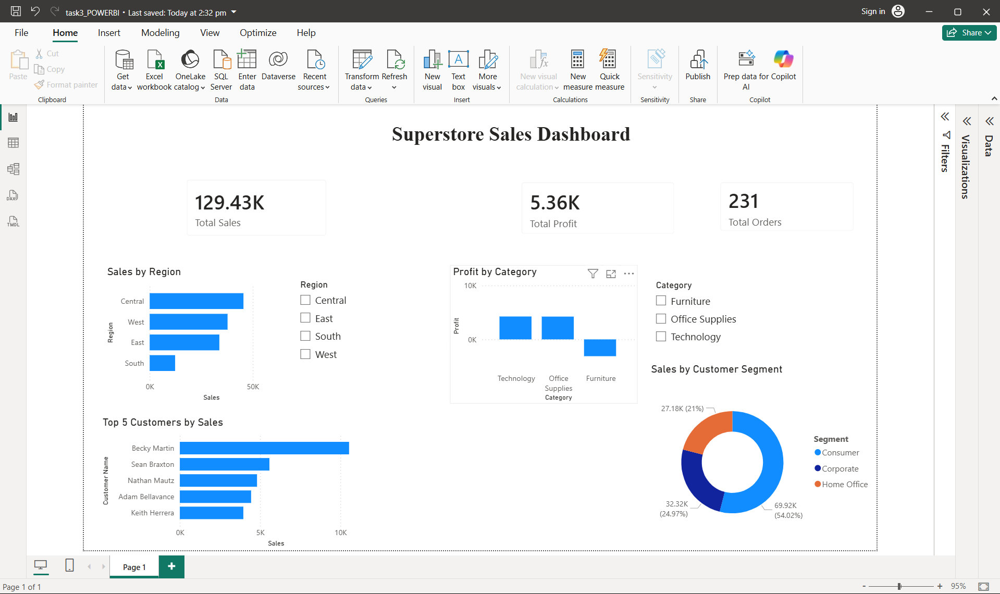
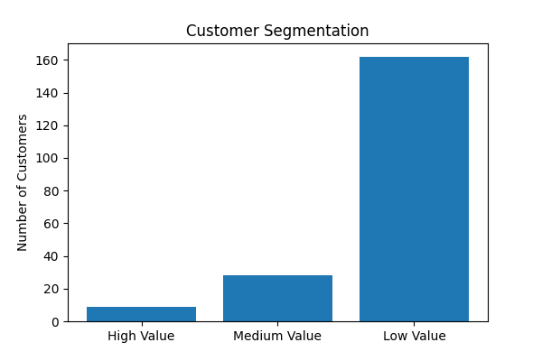
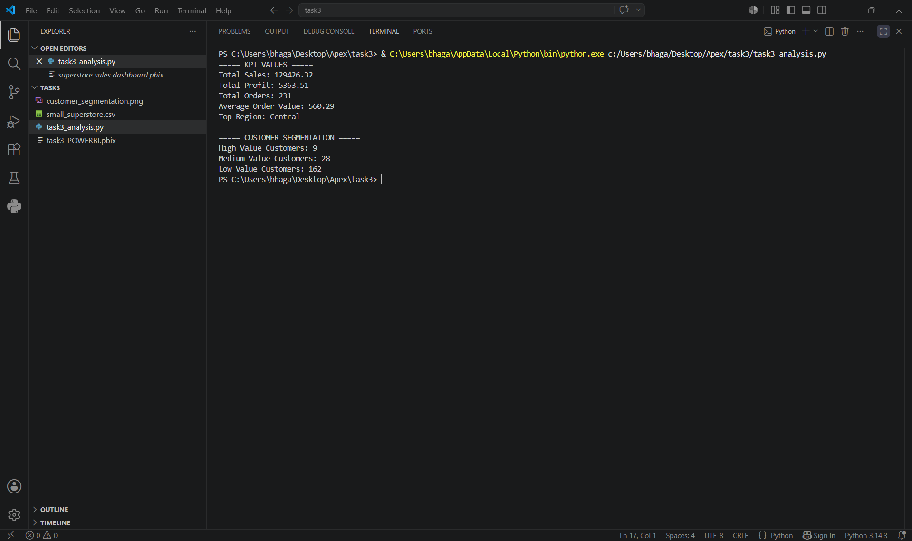

# Task 3- Deep-Dive Analysis & Interactive Dashboarding

## Objective

The objective of this project is to perform a deep-dive analysis of Superstore sales data, identify key business insights, define important KPIs, and build an interactive Power BI dashboard for data-driven decision making.

---

## Technologies Used

- Microsoft Excel
- Microsoft Power BI Desktop
- VS Code

---

## Dataset

Dataset Used: "small_superstore.csv"

The dataset contains information related to:
- Orders
- Customers
- Sales
- Profit
- Categories
- Regions
- Customer Segments

---

## Tasks Performed

### 1. KPI Definition
Created and analyzed key business metrics:
- Total Sales
- Total Profit
- Total Orders

### 2. Deep-Dive Analysis
Performed detailed analysis on:
- Sales by Region
- Profit by Category
- Top 5 Customers by Sales
- Customer Segmentation

### 3. Interactive Dashboard Development
Built an interactive Power BI dashboard with:
- KPI Cards
- Sales Analysis Visuals
- Profit Analysis Visuals
- Customer Analysis
- Region Slicer
- Category Slicer

---

## Dashboard Components

### KPI Cards
- Total Sales
- Total Profit
- Total Orders

### Visualizations
- Sales by Region
- Profit by Category
- Top 5 Customers by Sales
- Sales by Customer Segment

### Filters (Slicers)
- Region
- Category

---

## Dashboard Preview

---

## Customer Segmentation Analysis

## Outcome

The project successfully transformed raw sales data into an interactive business intelligence dashboard.

### Key Insights
- Central region generated the highest sales.
- Technology category showed strong profitability.
- Top customers contributed significantly to revenue.
- Consumer segment accounted for the largest share of sales.

### Business Value
- Improved sales performance tracking.
- Better understanding of customer behavior.
- Enhanced decision-making through interactive visualizations.
- Quick access to important KPIs and business insights.

---

## Author

**Khushi Bhagat**

